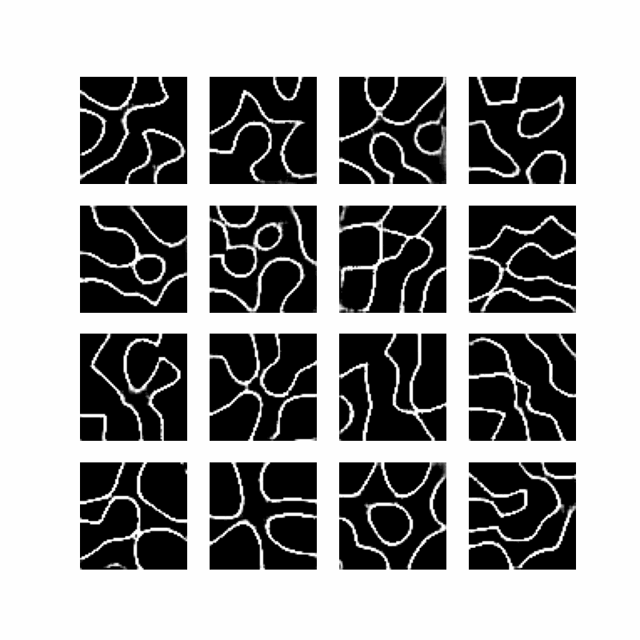

# Synthetic Microstructure Generation using WGAN-GP



**Objective** Design and implement a Wasserstein Generative Adversarial Network with Gradient Penalty (WGAN-GP) to synthesize high-fidelity Voronoi material microstructures. This project leverages advanced optimization techniques—including Mixed Precision training and Two-Time-Scale Update Rules—to address "mode collapse" and generate scientifically accurate grain boundaries for computational material science.

## 1. Architecture & Model Design

**Approach:**
* **Generator:** Deep upsampling network (Latent Dim → 64×64) utilizing `UpSampling2D` and `Conv2D`. [cite_start]Deliberately excludes Batch Normalization to prevent artifacting in texture generation [cite: 179-199].
* [cite_start]**Critic (Discriminator):** Deep convolutional network with strided convolutions, `LeakyReLU` activations, and linear output (no Sigmoid) to approximate the Wasserstein distance [cite: 200-213].
* [cite_start]**WGAN-GP Loss:** Implements Wasserstein loss with Gradient Penalty ($\lambda=10$) to enforce the 1-Lipschitz constraint for stable gradients [cite: 140, 264-279].
* **Weight Initialization:** Random Normal initialization aligned with WGAN convergence requirements.

**Key Achievements:**
* Solved "mode collapse" issues inherent in DCGANs, producing diverse grain structures.
* Achieved stable adversarial training where Critic loss correlates with generation quality.
* Generated sharp, realistic grain boundaries and triple junctions without blurring.

## 2. Data Pipeline & Preprocessing

**Approach:**
* [cite_start]**Data Ingestion:** Automated pipeline handling H5 file parsing and stacking from compressed Voronoi datasets [cite: 148-164].
* [cite_start]**Normalization Strategy:** Dynamic normalization mapping pixel values to $[-1, 1]$ to align with the Generator's `tanh` activation output [cite: 170-175].
* [cite_start]**TF Data Pipeline:** Optimized `tf.data.Dataset` with shuffling and batching for efficient GPU streaming[cite: 176].

**Key Achievements:**
* Seamless handling of high-dimensional microstructure datasets.
* Optimized memory usage allowing for larger batch sizes (64) on consumer GPUs.
* Robust preprocessing ensuring numerical stability during high-variance GAN training.

## 3. Training Infrastructure & Monitoring

**Problem Solved:** GANs are notoriously unstable. This project implements a custom training loop with specialized scheduling to ensure the Critic stays ahead of the Generator.

**Approach:**
* [cite_start]**Two-Time-Scale Update Rule (TTUR):** Implements distinct learning rates for Generator ($1e^{-4}$) and Critic ($4e^{-4}$) [cite: 128-129].
* [cite_start]**Cosine Decay Scheduler:** Adaptive learning rate scheduling for both networks to fine-tune convergence in later epochs [cite: 224-233].
* [cite_start]**Automated Checkpointing:** System to save/restore model states, allowing training resumption after interruptions [cite: 244-252].
* [cite_start]**Visual Monitoring:** Automatic generation of GIF frames every epoch to track the "coarse-to-fine" learning process [cite: 306-318].

**Key Achievements:**
* Robust training loop with automatic crash recovery/resume.
* Clear visual documentation of microstructural evolution via animated GIFs.
* Stable loss convergence (~ -25) indicating continuous learning.

## 4. Technical Implementation & Optimization

**Programming Language:** Python 3.8+

**Deep Learning Stack:**
* [cite_start]**TensorFlow 2.x / Keras:** Core framework for graph construction [cite: 107-109].
* [cite_start]**Mixed Precision (AMP):** Enabled `mixed_float16` policy to reduce VRAM usage by ~50% and accelerate training throughput on NVIDIA GPUs [cite: 121-122].
* **NumPy & h5py:** High-performance numerical computation and data handling.
* **ImageIO:** For generating training progression animations.

**Advanced Features:**
* [cite_start]**Gradient Penalty:** Manually computed gradients of the Critic with respect to interpolated images to enforce Lipschitz continuity [cite: 268-279].
* [cite_start]**Loss Scaling:** Integrated `LossScaleOptimizer` to prevent underflow during mixed-precision training [cite: 241-242].
* [cite_start]**Custom Train Step:** Overrode standard `train_step` to implement specific WGAN-GP logic [cite: 281-303].

## 5. Key Results & Performance

* **Sample Output:** Synthesized 64×64 microstructures indistinguishable from ground truth Voronoi tessellations.
* **Training Stability:** Critic loss converged stably without oscillation, providing a reliable metric for optimization.
* **Efficiency:** High-performance pipeline capable of training on T4 GPUs within reasonable timeframes due to AMP optimizations.

**Impact:**
* Enables rapid generation of synthetic material datasets for downstream ML models.
* Provides a foundation for Conditional GANs (cGAN) for property-driven material design.
* Demonstrates mastery of advanced Generative AI optimization techniques.

## 6. Technical Achievements

* **Generative AI:** Implementation of WGAN-GP, one of the most stable GAN architectures.
* **Model Optimization:** Usage of Mixed Precision (AMP) and Learning Rate Schedulers.
* **Production Features:** Checkpointing, automated GIF generation, and modular code structure.
* **Visualization:** Real-time tracking of grain boundary formation.

---

## Usage

**Prerequisites:**
* Google Colab (T4 GPU recommended) or Local CUDA Environment
* Dataset: `Voronoi_micro_imgs.zip` (Uploaded to root)

**Setup:**

1.  **Install Dependencies:**
    ```python
    !pip install imageio tensorflow-docs
    ```

2.  **Run the Training Script:**
    ```python
    # Execute cells sequentially. 
    # The script handles zip extraction, data loading, and model training.
    ```

3.  **Resume Training:**
    ```python
    # Checkpoints are saved to ./checkpoints
    # Re-running the script automatically detects and restores the latest checkpoint.
    ```

**Generated Output:**
* [cite_start]**Checkpoints:** Saved locally in `./checkpoints`[cite: 245].
* [cite_start]**Visuals:** Progress frames saved to `./gif_frames`[cite: 143].
* **Animation:** Final training evolution saved as `voronoi_training_animation.gif`.
* **Metrics:** Loss curves for Generator and Critic.

**Customization:**
* [cite_start]Adjust `epochs` or `batch_size` in the `config` dictionary [cite: 125-126].
* [cite_start]Modify `gp_weight` (Gradient Penalty weight) to tune training stability[cite: 140].
* [cite_start]Change `z_noise_dim` to alter the latent space complexity[cite: 133].
